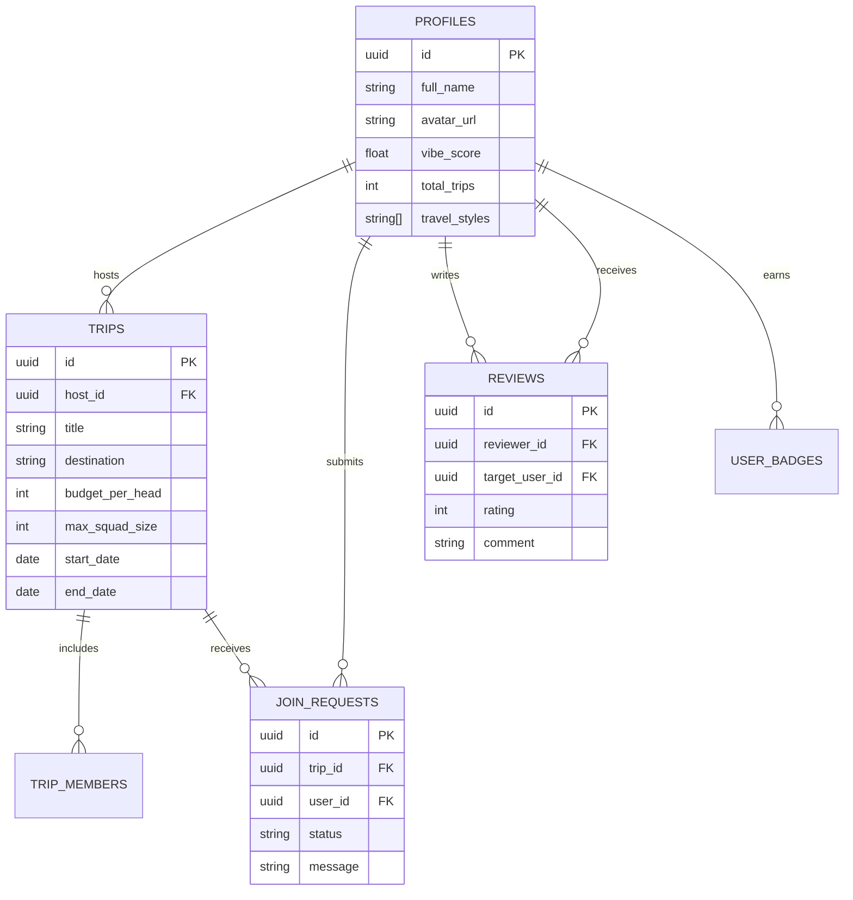

# 🎒 Karvaan (कारवां) — Tinder for Group Travel & Budgeting

<div align="center">

[](https://nextjs.org/)
[](https://www.typescriptlang.org/)
[](https://tailwindcss.com/)
[](https://supabase.com/)
[](https://www.framer.com/motion/)
[](https://opensource.org/licenses/MIT)

**Swipe. Match. Split. Travel.**  
*A modern travel matchmaking and group budgeting platform connecting adventurous travelers, trekkers, and backpackers into trusted travel squads with verified Vibe Scores.*

[Key Features](#-key-features) • [Tech Stack](#-tech-stack) • [Quick Start](#-quick-start) • [Project Structure](#-project-structure) • [Database Architecture](#-database-architecture) • [Deployment](#-deployment)

</div>

---

## 🌟 Overview

**Karvaan** solves the friction of finding compatible travel companions and managing shared group expenses. Combining the intuitive swiping mechanics of modern dating apps with transparent kitty budgeting and peer accountability, Karvaan ensures you only travel with vetted people who match your frequency.

- 🃏 **Swipe on Curated Trips**: Swipe Right to send a *Join Request*, or Left to *Pass*.
- ⭐ **Peer-Reviewed Vibe Scores**: Build trusted reputations through mutual post-trip ratings and community badges.
- 💰 **Transparent Group Kitty**: Clear per-head cost estimations and total pool calculators.
- 🧭 **Host Command Center**: Trip leaders can review applicant vibe history and approve squad members.
- 🔄 **Zero-Setup Mock Mode**: Fully testable out-of-the-box with multi-persona switcher, even without Supabase credentials.

---

## ✨ Key Features

### 🃏 1. Framer Motion Swipe Deck
- Smooth gesture physics with drag rotation, velocity-based fling animations, and dynamic `JOIN` / `PASS` stamps.
- Filter trips by travel style: **Trek**, **Road Trip**, **Backpacking**, **Chill & Relax**, **Luxury**, and **Cultural Heritage**.
- Detailed modal preview with full itineraries, inclusions, exclusions, and host information.

### ⭐ 2. Dynamic Vibe Score & Trust Badges
- **1-to-5 Star Reputation System** aggregated from mutual traveler reviews.
- Community-awarded badges:
  - ⚡ *Punctual* • 🏖️ *Chill & Easygoing* • 💰 *Budget Maestro*
  - 📸 *Photographer* • 🧭 *Navigation Pro* • 🎉 *Party Starter* • 🛡️ *Safety First*

### 🧭 3. Host Command Center
- Review incoming traveler requests with full profile and vibe breakdown.
- 1-click **Accept / Reject** actions that instantly update squad availability and trigger celebration confetti.

### 💰 4. Group Kitty & Split Calculator
- Per-head budget breakdown (Stay, Travel, Food, Buffer/Activities).
- Real-time calculations for total squad budget and remaining slots.

### 👥 5. Instant Multi-Persona Switcher
- Switch instantly between 6 pre-seeded traveler personas to test both Host and Applicant perspectives without repeated logins:
  - 🏔️ **Aarav Sharma** (Host & Trekker)
  - 🌊 **Rhea Sen** (Beach & Culture Enthusiast)
  - 🏕️ **Kabir Mehta** (Roadtripper & Photographer)
  - 🧘 **Ananya Iyer** (Backpacker & Wellness Explorer)
  - 🚵 **Dev Malhotra** (Adventure & Bike Enthusiast)
  - 🎨 **Tanvi Joshi** (Heritage & Food Explorer)

---

## 🛠️ Tech Stack

| Layer | Technology | Description |
| :--- | :--- | :--- |
| **Framework** | [Next.js 14](https://nextjs.org/) | App Router, Server/Client components, optimized rendering |
| **Language** | [TypeScript](https://www.typescriptlang.org/) | Strict type safety and clear data contracts |
| **Styling** | [Tailwind CSS](https://tailwindcss.com/) | Curated cinematic design, glassmorphism, responsive UI |
| **Animations** | [Framer Motion](https://www.framer.com/motion/) | Card swipe gestures, exit transitions, floating capsules |
| **Icons** | [Lucide React](https://lucide.dev/) | Consistent, lightweight SVG icon system |
| **Effects** | [Canvas Confetti](https://www.npmjs.com/package/canvas-confetti) | Dynamic celebration effects on match and host approvals |
| **Backend / DB** | [Supabase](https://supabase.com/) | PostgreSQL, Row Level Security (RLS), Triggers & SSR client |

---

## 📁 Project Structure

```bash
Karvaan/
├── .github/
│   └── workflows/
│       └── deploy.yml          # CI/CD verification workflow
├── src/
│   ├── app/
│   │   ├── globals.css         # Custom animations, design tokens & typography
│   │   ├── layout.tsx          # Root layout with AppProvider & Navigation
│   │   ├── page.tsx            # Main swipe feed and featured discovery
│   │   ├── host/
│   │   │   └── page.tsx        # Host approval command center
│   │   ├── profile/
│   │   │   └── page.tsx        # User profile, badges & travel history
│   │   ├── reviews/
│   │   │   └── page.tsx        # Mutual reviews & vibe scoring center
│   │   └── trips/
│   │       ├── [id]/page.tsx   # Detailed trip & squad roster view
│   │       └── new/page.tsx    # Create trip & kitty budget form
│   ├── components/
│   │   ├── HostRequestCard.tsx # Applicant request review card
│   │   ├── LeftSidebar.tsx     # Navigation & fast filter sidebar
│   │   ├── Navbar.tsx          # Brand header, persona switcher & actions
│   │   ├── ReviewFormModal.tsx # Star rating & badge submission modal
│   │   ├── RightSidebar.tsx    # Active squad chats & upcoming trips
│   │   ├── SwipeCard.tsx       # Framer motion gesture swipe card
│   │   ├── SwipeFeed.tsx       # Card stack orchestrator
│   │   ├── TripDetailsModal.tsx# Comprehensive trip modal preview
│   │   ├── UserSwitcher.tsx    # Multi-persona switcher dropdown
│   │   ├── VibeBadge.tsx       # Visual badge component with tooltip
│   │   └── VibeScorePill.tsx   # Color-coded vibe rating pill
│   ├── context/
│   │   └── AppContext.tsx      # Global state for trips, requests, reviews & user
│   ├── hooks/
│   │   └── useWindowSize.ts    # Responsive viewport utility
│   └── lib/
│       ├── mockData.ts         # Pre-seeded users, trips, requests & reviews
│       ├── supabaseClient.ts   # Supabase client with graceful fallback
│       ├── types.ts            # TypeScript definitions
│       └── utils.ts            # Currency formatters, dates, clsx helpers
├── supabase/
│   ├── migrations/             # PostgreSQL DDL & RLS policies
│   └── seed.sql                # Initial seed data for live Supabase instances
├── .env.example                # Sample environment configuration
├── package.json
├── tailwind.config.ts
└── tsconfig.json
```

---

## 🚀 Quick Start

### Prerequisites
- [Node.js](https://nodejs.org/) (version 18.17.0 or higher recommended)
- [npm](https://www.npmjs.com/) or [pnpm](https://pnpm.io/)

### 1. Clone the Repository
```bash
git clone https://github.com/Souvik-Das-23/Karvaan.git
cd Karvaan
```

### 2. Install Dependencies
```bash
npm install
```

### 3. Setup Environment Variables (Optional)
Karvaan includes a **built-in mock mode** that works immediately without any external database setup.

To connect a live Supabase project, copy `.env.example` to `.env.local`:
```bash
cp .env.example .env.local
```

Fill in your Supabase credentials:
```env
NEXT_PUBLIC_SUPABASE_URL=https://your-project-ref.supabase.co
NEXT_PUBLIC_SUPABASE_ANON_KEY=your-supabase-anon-key
```

### 4. Run Development Server
```bash
npm run dev
```
Open [http://localhost:3000](http://localhost:3000) in your browser.

---

## 🗄️ Database Architecture

Karvaan's database schema is designed for PostgreSQL on Supabase with Row Level Security (RLS):



SQL migration files and seed data are located in:
- `supabase/migrations/20260930000001_init_schema.sql`
- `supabase/seed.sql`

---

## 🌐 Deployment

### Deploy with Vercel

[](https://vercel.com/new/clone?repository-url=https%3A%2F%2Fgithub.com%2FSouvik-Das-23%2FKarvaan)

#### Manual Deployment Steps:
1. Push your code to GitHub.
2. Go to [Vercel Dashboard](https://vercel.com/new) and click **"Add New Project"**.
3. Select the `Souvik-Das-23/Karvaan` repository.
4. Keep the **Root Directory** as `./` and Framework as **Next.js**.
5. *(Optional)* Add `NEXT_PUBLIC_SUPABASE_URL` and `NEXT_PUBLIC_SUPABASE_ANON_KEY` in **Environment Variables**.
6. Click **Deploy**.

#### Terminal Deployment:
```powershell
npx vercel
```
For production:
```powershell
npx vercel --prod
```

---

## 🤝 Contributing

Contributions, issues, and feature requests are welcome!
1. Fork the Project
2. Create your Feature Branch (`git checkout -b feature/AmazingFeature`)
3. Commit your Changes (`git commit -m 'feat: Add some AmazingFeature'`)
4. Push to the Branch (`git push origin feature/AmazingFeature`)
5. Open a Pull Request

---

## 📄 License

Distributed under the **MIT License**. See [`LICENSE`](./LICENSE) for more information.